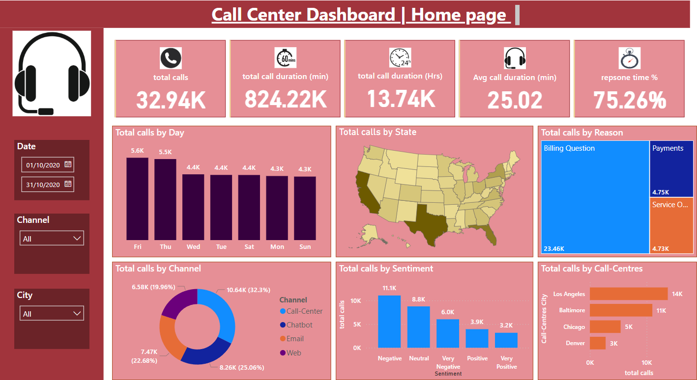
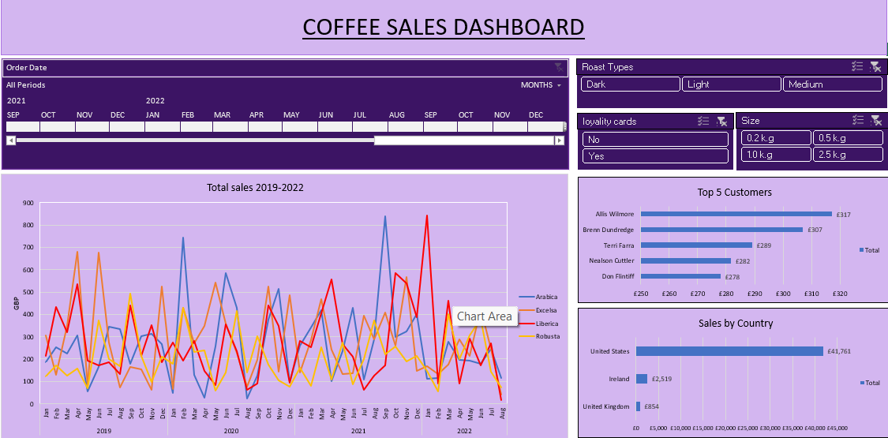

Title: Dylan Ellis - Data Analytics Portfolio
---


# 📊 Dylan Ellis - Data Analytics Portfolio

Welcome! I'm **Dylan Ellis**, the tools i have used within this portfolio are; Power BI, SQL, and Excel.  
This portfolio showcases my work in data cleaning, vizulaization and reporting. I have deliberatley chosen 
a variety of different dataset's to gain experience with a wide range of different skills from HR, financial and non-financial trends. 
Please download the zip folder above to access my Power BI, Excel and SQL interactive dashboards and codes. The current steps i am taking to
add to this portfolio is Python.

---

## 🔹 Featured Projects  

### 📞 Call Center Dashboard (Power BI)  
📌 **Description:** A Power BI dashboard analyzing **call center performance, agent efficiency, and customer satisfaction.**  

✔ **Key Metrics:** Call volume, resolution rates, agent performance, identifying KPI's  
✔ **Interactive Filters:** Analyze trends dynamically 

image: 

#### 🔹 How to Use the Dashboard  
1. **Open the Power BI File** – Download and open the `.pbix` file in **Power BI Desktop** (latest version recommended).  
2. **Explore Key Metrics** – Navigate through different **KPIs and visuals** for insights on call center performance.  
3. **Use Filters & Slicers** – Filter by **date, agent, and department** to analyze specific trends.  
4. **Hover for Insights** – Tooltips provide additional details on each metric.  
5. **Export Reports** – Use Power BI’s export options to generate **PDF or Excel reports** for stakeholders.  

👉 [assets/docs/call center dashboard.pbix](#)  

---

## 🚀 Skills & Tools  

- **Power BI** – Dashboarding, DAX, Data Modeling, slicers  
- **SQL** – Queries, Joins, Data Cleaning  
- **Excel** – Pivot Tables, Data Analysis, Automation  

---

# ☕ Coffee Sales Dashboard (Excel)  

## 📌 Overview  
This Coffee Sales Dashboard, built in Microsoft Excel, provides insights into sales performance, customer trends, and revenue distribution. The dashboard helps analyze key metrics, visualize trends, and make data-driven business decisions.  

## 📊 Key Features  

- **📈 Sales Performance Tracking** – Total revenue, average sales per transaction, and growth trends.  
- **🌍 Regional Sales Breakdown** – Identify top-performing locations.  
- **🛍 Product Category Insights** – Analyze which coffee products sell the most.  
- **📅 Time-Based Trends** – Monthly and seasonal sales analysis.  
- **📌 Interactive Slicers & Filters** – Dynamic filtering by product, region, and time period.  

## 🔧 Tools & Techniques Used  

- **Microsoft Excel**  
- **Pivot Tables & Pivot Charts**  
- **Data Cleaning & Transformation**  
- **Conditional Formatting**  
- **Advanced Formulas & Functions (SUMIFS, VLOOKUP, INDEX-MATCH)**  

## 📊 Sample Dashboard Preview  
  

## 📥 How to Use  
1. **Download the Excel file** from this repository.  
2. Open it in **Microsoft Excel (2016 or later)** for full functionality.  
3. Use the interactive features of the **slicers & filters** to explore different aspects of the sales data.  
4. Analyze trends and use insights to optimize sales strategy.  

👉 [assets/docs/Coffee sales Excel dashboard.xlsx](#)  

---

# 📊 Layoffs Data Analysis (SQL)

## 📌 Overview  
This project focuses on **data cleaning and exploratory analysis** of layoffs data using **SQL**. The dataset contains information on companies, industries, total layoffs, and other key business metrics. The goal is to clean messy data, standardize formats, and extract valuable insights about layoff trends.

---

## 🔹 Data Cleaning Steps  

✔ **Removing Duplicates** – Identified and removed duplicate records using `ROW_NUMBER()`.  
✔ **Standardizing Data** – Trimmed whitespace, formatted dates, and corrected inconsistent industry names.  
✔ **Handling Null & Blank Values** – Replaced missing values using reference data from the same company.  
✔ **Removing Unnecessary Columns** – Eliminated rows with missing key metrics.  

🚀 **Key Queries Used:** `ROW_NUMBER()`, `UPDATE`, `DELETE`, `ALTER TABLE`, `STR_TO_DATE()`  

### Example within my code
```SQL
WITH duplicate_cte AS (
    SELECT *,
        ROW_NUMBER() OVER(
            PARTITION BY company, location, industry, total_laid_off, percentage_laid_off, `date`, stage, country, funds_raised_millions
        ) AS row_num
    FROM layoffs_staging
)
DELETE FROM layoffs_staging
WHERE row_num > 1;
```

## 🔧 Technologies & Skills  

- **SQL (MySQL / PostgreSQL)**  
- **Data Cleaning & Transformation**  
- **CTEs & Window Functions**  
- **Aggregations & Ranking**  
- **Trend Analysis & Reporting**  

## 📥 How to Use  
1. **Clone the repository** using the command below:  
   ```sh
   git clone https://github.com/dylanjellis/sql-layoffs-analysis.git
2. Import the dataset into MySQL / PostgreSQL.
3. Run the cleaning queries to process and standardize the raw data.
4. Execute the exploratory analysis queries to uncover key insights.


---

###🔍 Exploratory Data Analysis (EDA)  

✔ **Total Layoffs Per Company** – Ranked companies with the highest layoffs.  
✔ **Industry-Wise Analysis** – Summarized layoffs by sector to identify the most affected industries.  
✔ **Yearly & Monthly Trends** – Used window functions to calculate rolling totals over time.  
✔ **Top Companies Per Year** – Used `DENSE_RANK()` to determine yearly layoff leaders.  

🚀 **Key Queries Used:** `SUM()`, `GROUP BY`, `ORDER BY`, `DENSE_RANK()`, `WITH (CTE)`, `WINDOW FUNCTIONS`  

---

## 📌 Sample Queries  

### 🔹 **Top 5 Companies With Highest Layoffs Per Year**
```sql
WITH Company_Year (company, years, total_laid_off) AS (
    SELECT company, YEAR(`date`), SUM(total_laid_off)
    FROM layoffs_staging2
    GROUP BY company, YEAR(`date`)
), company_year_rank AS (
    SELECT *, DENSE_RANK() OVER (PARTITION BY years ORDER BY total_laid_off DESC) AS Ranking
    FROM Company_Year
    WHERE years IS NOT NULL
)
SELECT * FROM company_year_rank
WHERE Ranking <= 5;
```

## 🔧 Technologies & Skills  

- **SQL (MySQL / PostgreSQL)**  
- **Data Cleaning & Transformation**  
- **CTEs & Window Functions**  
- **Aggregations & Ranking**  
- **Trend Analysis & Reporting**  

---

## 📥 How to Use  
1. **Clone the repository** using the command below:
```sh
git clone https://github.com/dylanjellis/sql-layoffs-analysis.git
3. Import the dataset into MySQL / PostgreSQL.
4. Run the cleaning queries to process and standardize the raw data.
5. Execute the exploratory analysis queries to uncover key insights.


## 📬 Contact Me  

📎 **LinkedIn:** [www.linkedin.com/in/dylan-ellis-b11a042b3](#)  
🌍 **GitHub:** [https://github.com/dylanjellis](#)  
📧 **Email:** [Dylanjayellis@yahoo.co.uk](#)  
